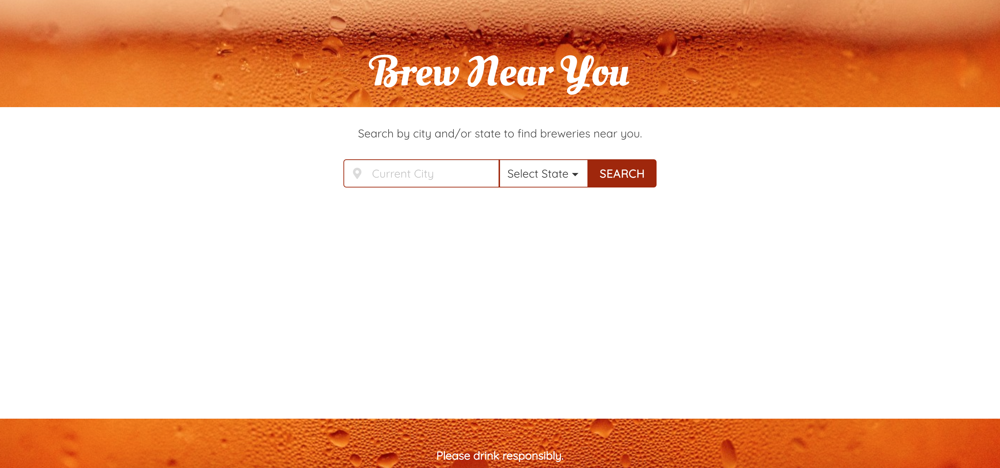
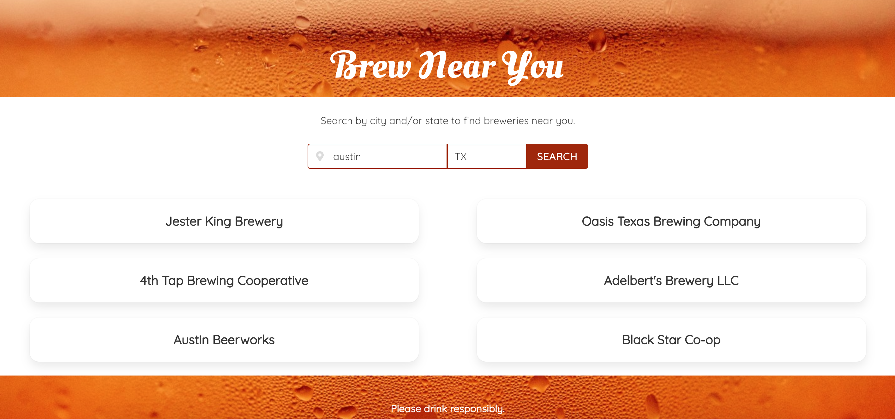
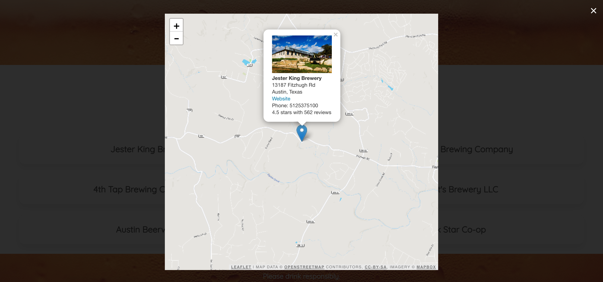

# Brew Near You
This application is intended to allow users to search by city and/or state for breweries and bars that serve beer in that location. All search results are generated on the landing page and are displayed with the appropriate brewery name. Upon clicking a result, the user is given the brewery's location along with additional information provided by Open Brewery DB and Yelp.

# User story
Story #1

AS a beer enthusiast

I want to find breweries in the location of my choosing

SO THAT I can gain general information about specific breweries 

Story #2

AS a tourist

I want to find a local brewery

So that I can try local beers

# Getting Started
1. Type in a city and/or select a state
2. Leave both city and state fields empty to use current location
3. Click the SEARCH button to generate a list of breweries in the desired area 
4. Click on a result for more information
5. A modal appears displaying the following information: brewery name, image, address, website, phone number, yelp rating, number of reviews, and location on map
6. Click the black background or the X in the upper-right corner to close the modal

# Link
https://atb5498.github.io/brew-near-you/

# Built With
Bulma - https://bulma.io/

jQuery - https://jquery.com/

Open Brewery DB - https://www.openbrewerydb.org/

Yelp Fusion - https://www.yelp.com/fusion

Leaflet - https://leafletjs.com/

Mapquest - https://developer.mapquest.com/
